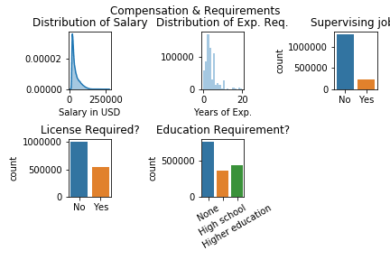

# Datafest18

## Overview
As part of [DataFest 2018](http://datafest.blogs.wesleyan.edu/2018/04/10/thats-a-wrap-on-datafest-2018/), our team created an RShiny App that helps job seekers know **where** and **when** they should be looking for their dream job. 

Using the data provided by Indeed.com for the competition and Zillow housing prices data, we mapped out locations wherein standard of living (calculated by substractive ave. housing prices from estimated salary) was highest and visualized the inflow and outflow of job postings in the year 2016.

## Competition Parameters
The data was released at 6 pm on Apr 6 (Fri) and presentations were due at 12 pm on Apr 8 (Sun). We were given free reign to explore the data given and encouraged to pull outside datasets. 

The following questions were provided as starting points:

* What information about the economy can Indeed provide that government data can't?
* What advice would you give a student graduating from HS about where to look for a job?
* How does Indeed's data compare to official government data on the labor market? Can it be used to provide good economic indicators?

## Data
### Data Description: Indeed.com
The full data set consists of over 1.76 millions rows, wherein each row is a snapshot of a job posting on a day. The job postings spanned from Nov 1, 2016 to Nov 30, 2017. 

Here are a few of the variables we found to be most important:

* Industry associated with the company
* Education requirement
* Age of job posting in 

Here is an image with summary statistics of all the variables provided

### Data Manipulation
* We imputed *industry* with a random forest because 90% of the data was missing. We used the normalized job title as predictors 
* We 

## WebApp Functionalities

